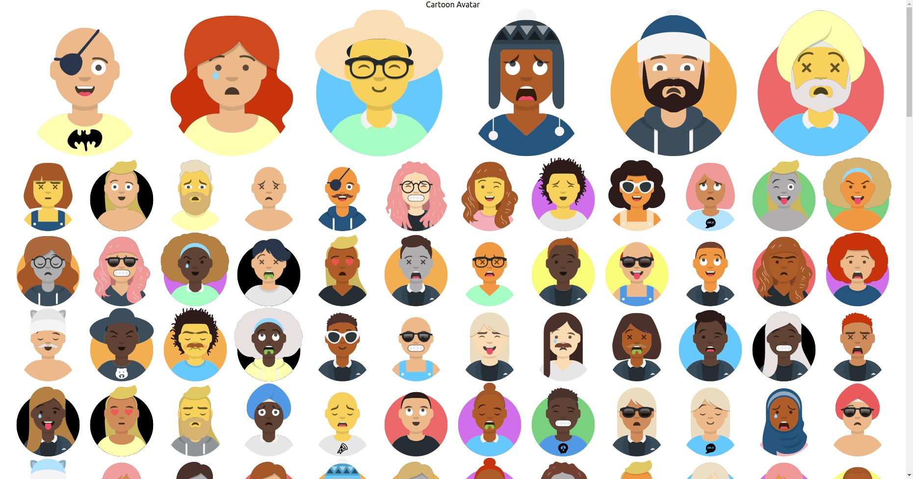

# cartoon-avatars

Typescript ReactJS component port for generating personalized cartoon avatars
See original tool at www.getavataaars.com

### Example Usage

```typescript jsx
import React from 'react'
import './App.css'
import Avatar, { AvatarConfiguration } from './cartoon-avatar'
import { saveAsPng } from './cartoon-avatar/util/tools'
import { randomizeAvatar } from './cartoon-avatar/util/randomizer'


const settings: AvatarConfiguration = {
  circle: {
    enabled: false,
    color: 'Black',
  },
  skin: 'Light',
  clothes: {
    outfit: 'GraphicShirt',
    color: 'PastelYellow',
    graphic: 'Bat',
  },
  face: {
    eyebrows: 'UpDown',
    eyes: 'Surprised',
    mouth: 'Smile',
    nose: 'Default',
  },
  hair: {
    style:'Eyepatch'
  }
}

const App: React.FC = () => {

  const a = []
  for (let i = 1; i < 300; i++) {
    a.push(<Avatar
      id={`randomAvatar${i}`}
      settings={randomizeAvatar()}
      style={{ width: 150, height: 150 }}
    />)
  }

    return (
      <div className="App">
        Cartoon Avatar
        <br />
        {/*<div style={styles}>*/}
        <Avatar
          id="myAvatar"
          settings={settings}
          style={{ width: 300, height: 300 }}
        />
        <Avatar
          id="myAvatar2"
          settings={randomizeAvatar()}
          style={{ width: 300, height: 300 }}
        />
        <Avatar
          id="myAvatar3"
          settings={randomizeAvatar()}
          style={{ width: 300, height: 300 }}
        />
        <Avatar
          id="myAvatar4"
          settings={randomizeAvatar()}
          style={{ width: 300, height: 300 }}
        />
        <Avatar
          id="myAvatar5"
          settings={randomizeAvatar()}
          style={{ width: 300, height: 300 }}
        />
        <Avatar
          id="myAvatar6"
          settings={randomizeAvatar()}
          style={{ width: 300, height: 300 }}
        />
        {a.map(v=>v)}
        {/*</div>*/}
        <canvas
          id="myCanvas"
          width={280}
          height={280}
          style={{ display: 'none' }}
        />
        <button onClick={() => saveAsPng(settings)}>Save PNG</button>
      </div>
    )
}

export default App
```

### Example Output to Screen

